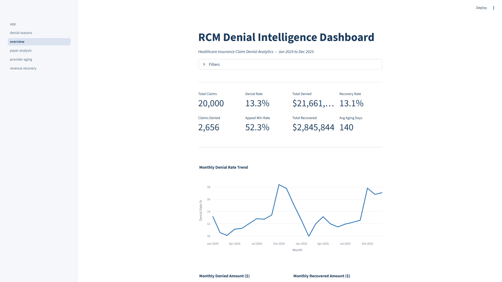
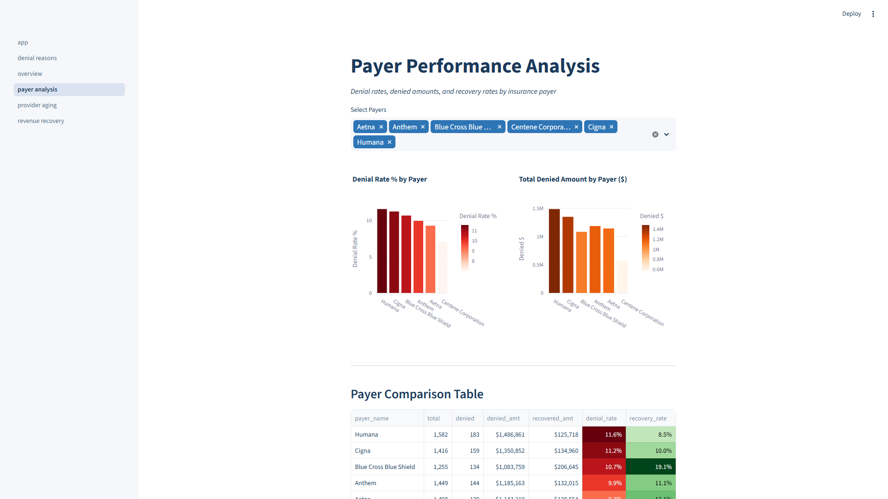
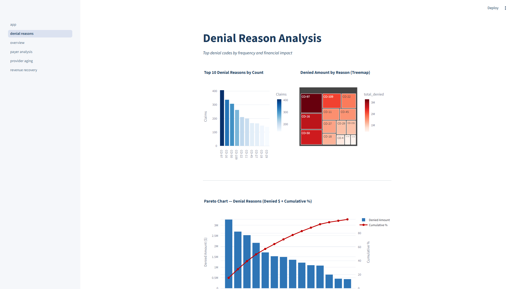
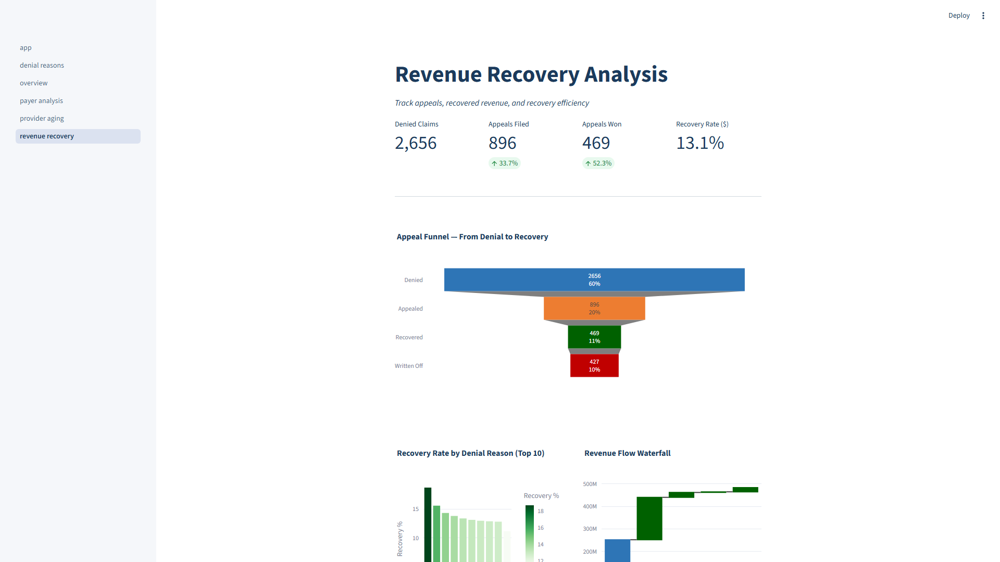
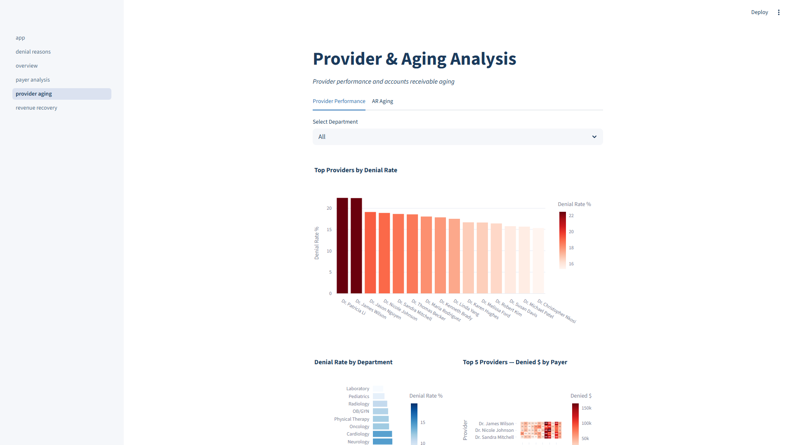

# RCM Claims Denial Intelligence Dashboard

A healthcare revenue cycle analytics portfolio project built with **Python, SQL, and Excel** — synthetic claims generation, SQL analysis, formatted Excel workbook, and interactive Streamlit dashboard.

---

## Quickstart

```bash
uv venv && uv pip install -r requirements.txt
python data/generate_data.py          # 20,000 synthetic claims
python excel/build_dashboard.py       # Formatted Excel workbook
streamlit run dashboard/app.py        # Interactive web dashboard
```

---

## Architecture

```
synthetic data ──► CSV ──► pandas ──► Excel workbook (6 sheets)
 (Faker)           │         │
                   │         └───────► Streamlit app (5 pages)
                   │
                   └──────────► SQL analysis (6 files)
```

---

## Streamlit Dashboard

### 1. Overview
KPI cards (total claims, denial rate, denied $, recovery rate), date range & payer type filters, monthly denial rate trend, denied and recovered bar charts.



### 2. Payer Performance
Per-payer denial rate bars, denied $ bars, recovery rate, appeal rate vs success grouped bars, payer type summary cards, styled comparison table.



### 3. Denial Reasons
Top-10 bar chart, treemap of denied amounts, interactive Pareto (bar + cumulative line), per-payer reason breakdown.



### 4. Revenue Recovery
Appeal funnel (denied → recovered → written off), revenue waterfall, recovery rate by reason, recovery timeline histogram, monthly recovery trend.



### 5. Provider & Aging
Department filter, provider denial rate bars (top 15), department horizontal chart, provider-payer heatmap. AR aging tab: bucket bars, pie distribution, aging by payer & department.



---

## Excel Dashboard

Generated entirely with **OpenPyXL** — no Excel required to produce.

| Sheet | Content |
|-------|---------|
| **Summary** | 8 KPI cards (total claims, denial rate, denied $, recovery rate, appeal win rate, avg aging), monthly trend table, denial rate line chart |
| **Payer Performance** | Denial rate % and denied $ bar charts by payer, styled with conditional formatting |
| **Denial Reasons** | Bar + cumulative line Pareto chart, 14 denial codes ranked by $ impact |
| **Revenue Recovery** | Revenue flow bar chart (billed → allowed → denied → recovered → written off), appeal metrics table |
| **Provider Drill-down** | Provider table with red/green conditional formatting (high/low denial), department horizontal bar chart |
| **Aging & AR** | Aging bucket distribution charts, outstanding AR by bucket, payer aging summary table |

---

## SQL Analysis Queries

6 files covering all RCM denial dimensions (SQLite-compatible):

| File | Queries | Dimensions |
|------|---------|------------|
| `01_denial_trends.sql` | 5 queries | Monthly counts, denial rate %, denied $, quarterly rollup, YoY comparison |
| `02_payer_performance.sql` | 5 queries | Payer denial rates, avg $ denied, recovery rate, appeal rate, payer type summary |
| `03_denial_reasons.sql` | 5 queries | Reason frequency, financial impact, Pareto cumulative %, category grouping, top reasons per payer |
| `04_revenue_recovery.sql` | 6 queries | Appeal funnel, $ recovered vs written off, recovery days by amount bucket, recovery by reason, monthly trends |
| `05_provider_drilldown.sql` | 5 queries | Provider denials, department rollup, top 10 worst, provider-payer matrix |
| `06_aging_ar.sql` | 5 queries | Aging buckets with $ amounts, aging by payer, aging by department, monthly aging trends with 90+ day analysis |

---

## Data Model

### claims (fact table)
20,000 records (Jan 2024 – Dec 2025) with realistic distributions:

| Attribute | Detail |
|-----------|--------|
| Payers | 12 (UnitedHealth, Aetna, BCBS, Cigna, Humana, Medicare, Medicaid, Tricare, Kaiser, Centene, Molina, Anthem) |
| Providers | 50 across 12 clinical departments |
| Denial codes | 14 (CO-16, CO-50, CO-97, CO-109, etc.) |
| Denial rate | ~13–15% |
| Recovery rate | ~17–20% of denied |
| Seasonal | Q4 denials 30% higher |
| Department factors | Emergency Medicine +30%, Laboratory -50% denial propensity |

### Claim Lifecycle
```
Billed → Allowed → [Paid]
                  → [Denied] → [Appealed] → [Recovered]
                                           → [Written Off]
```

### Key Metrics
| Metric | Formula |
|--------|---------|
| Denial Rate | `denied_claims / total_claims` |
| Recovery Rate | `recovered_amount / denied_amount` |
| Appeal Rate | `appealed_claims / denied_claims` |
| Appeal Success | `recovered_claims / appealed_claims` |
| Aging Days | `days from billing_date to resolution` |

---

## Project Structure

```
├── data/
│   └── generate_data.py              # Synthetic RCM claims generator
├── sql/
│   ├── schema.sql                    # Tables, indexes, views (SQLite)
│   ├── 01_denial_trends.sql          # Monthly/quarterly/YoY trends
│   ├── 02_payer_performance.sql      # Payer comparison
│   ├── 03_denial_reasons.sql         # Reason frequency + Pareto
│   ├── 04_revenue_recovery.sql       # Appeals + recovery timeline
│   ├── 05_provider_drilldown.sql     # Provider/department drill-down
│   └── 06_aging_ar.sql              # Aging buckets + AR analysis
├── excel/
│   └── build_dashboard.py            # OpenPyXL 6-sheet generator
├── dashboard/
│   ├── app.py                        # Streamlit entry point
│   ├── data_loader.py                # Shared cached loader
│   └── pages/
│       ├── overview.py               # KPI cards + trend charts
│       ├── payer_analysis.py          # Payer comparison
│       ├── denial_reasons.py          # Treemap + Pareto
│       ├── revenue_recovery.py        # Funnel + waterfall
│       └── provider_aging.py          # Provider rates + aging
├── .streamlit/
│   └── config.toml                   # Corporate blue theme
├── screenshots/                       # Dashboard screenshots
├── capture_screenshots.py            # Playwright screenshot tool
├── requirements.txt
└── README.md
```

---

## Tech Stack

| Layer | Tool | Version |
|-------|------|---------|
| Data Generation | Python + Faker | >=22.0 |
| Data Processing | pandas, numpy | >=2.0, >=1.26 |
| Excel Generation | OpenPyXL | >=3.1 |
| Web Dashboard | Streamlit + Plotly | >=1.30, >=5.15 |
| Screenshot Capture | Playwright | >=1.59 |
| Database (optional) | SQLite | built-in |

---

## How to Run

```bash
uv venv && uv pip install -r requirements.txt
python data/generate_data.py          # Step 1: Generate claims
python excel/build_dashboard.py       # Step 2: Build Excel workbook
streamlit run dashboard/app.py        # Step 3: Launch dashboard
```

---

## Phase Status

| # | Phase | Status |
|---|-------|--------|
| 1 | Data Generation & Database Setup | Complete |
| 2 | SQL Analysis Queries | Complete |
| 3 | Excel Dashboard | Complete |
| 4 | Streamlit Web Dashboard | Complete |
| 5 | Documentation & Polish | Complete |
